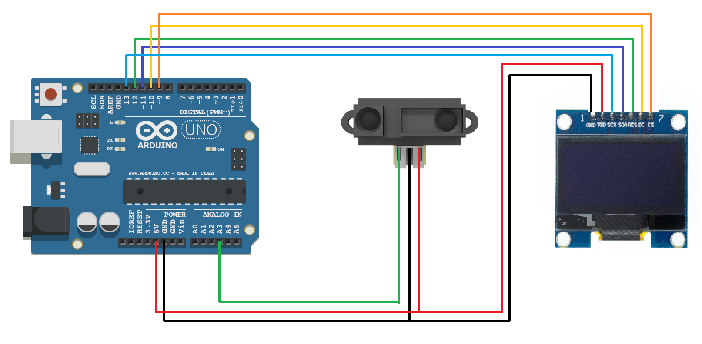

# digitalruler
An Arduino-Based Digital Ruler using OLED and a IR-Distance Sensor.

## Components Needed
- Arduino Uno *or* Arduino Compatable Board \([XC9202](https://www.jaycar.com.au/arduino-uno-rev3-arduino-development-board/p/XC9202) *or* [XC4410](https://www.jaycar.com.au/duinotech-uno-r3-main-board/p/XC4410)\) *or* an alternative microcontroller.
- SHARP IR Distance Sensor \([XC3735](https://www.jaycar.com.au/duinotech-arduino-compatible-ir-distance-sensor/p/XC3735)\)
- 128x64 OLED Display \([XC3735](https://www.jaycar.com.au/duinotech-arduino-compatible-1-3-inch-monochrome-oled-display/p/XC3728)\)
- Jumper Leads Mixed Pack \([WC6027](https://www.jaycar.com.au/jumper-lead-mixed-pack-100-pieces/p/WC6027)\)

## Wiring and Assembly
The wiring diagram is provided below:

Please note that you may require a breadboard to connect more that 1 wire to the 5V pin on the arduino.
You will also need to connect the bare-wires from the Distance Sensor to Dupont wires in order to connect to the Arduino.
This can be completed using the solder-splice and the wire-strippers.
